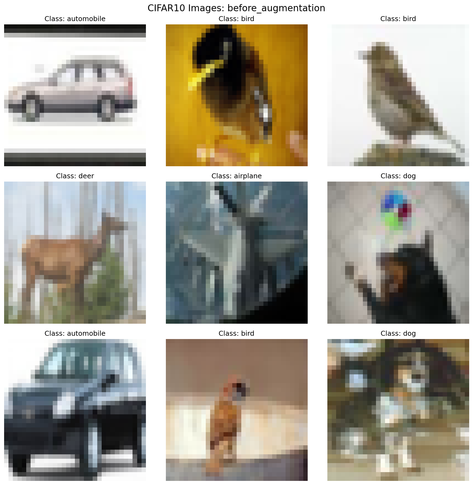
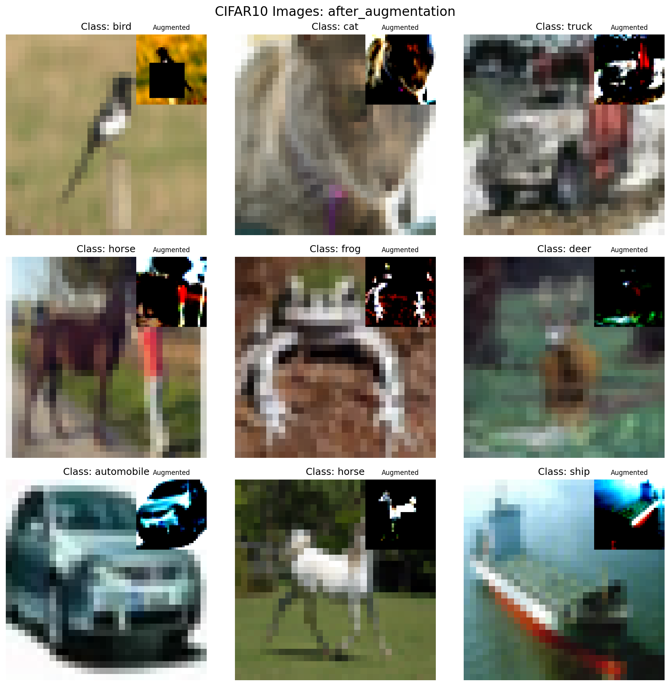

# CIFAR10 Image Classification

## Model Architecture (C1C2C3C40)

The model follows a C1C2C3C40 architecture with the following components:

1. **C1 (Initial Block)**
   - Conv2d(3, 24, k=3, p=1)
   - BatchNorm2d + ReLU + Dropout(0.03)
   - RF: 3x3

2. **C2 (Depthwise Separable Block)**
   - DepthwiseSeparableConv(24, 48, k=3, s=2)
   - BatchNorm2d + ReLU + Dropout(0.03)
   - RF: 7x7

3. **C3 (Dilated Conv Block)**
   - Conv2d(48, 84, k=3, d=2, p=2)
   - BatchNorm2d + ReLU + Dropout(0.03)
   - Conv2d(84, 84, k=3, s=2, p=1)
   - BatchNorm2d + ReLU + Dropout(0.1)
   - RF: 15x15

4. **C4 (Strided Conv Block)**
   - Conv2d(84, 128, k=3, s=2, p=1)
   - BatchNorm2d + ReLU + Dropout(0.1)
   - RF: 45x45

5. **Output (0)**
   - Global Average Pooling
   - Conv2d(128, 10, k=1)
   - Log Softmax

### Key Features
- No MaxPooling (replaced with strided convolutions)
- Uses Depthwise Separable Convolution in C2
- Uses Dilated Convolution in C3
- Total Parameters: ~200k
- Final Receptive Field: 45x45

```
----------------------------------------------------------------
        Layer (type)               Output Shape         Param #
================================================================
            Conv2d-1           [-1, 24, 32, 32]             672
       BatchNorm2d-2           [-1, 24, 32, 32]              48
              ReLU-3           [-1, 24, 32, 32]               0
           Dropout-4           [-1, 24, 32, 32]               0
            Conv2d-5           [-1, 24, 16, 16]             240
            Conv2d-6           [-1, 48, 16, 16]           1,200
DepthwiseSeparableConv-7           [-1, 48, 16, 16]               0
       BatchNorm2d-8           [-1, 48, 16, 16]              96
              ReLU-9           [-1, 48, 16, 16]               0
          Dropout-10           [-1, 48, 16, 16]               0
           Conv2d-11           [-1, 84, 16, 16]          36,372
      BatchNorm2d-12           [-1, 84, 16, 16]             168
             ReLU-13           [-1, 84, 16, 16]               0
          Dropout-14           [-1, 84, 16, 16]               0
           Conv2d-15             [-1, 84, 8, 8]          63,588
      BatchNorm2d-16             [-1, 84, 8, 8]             168
             ReLU-17             [-1, 84, 8, 8]               0
          Dropout-18             [-1, 84, 8, 8]               0
           Conv2d-19            [-1, 128, 4, 4]          96,896
      BatchNorm2d-20            [-1, 128, 4, 4]             256
             ReLU-21            [-1, 128, 4, 4]               0
          Dropout-22            [-1, 128, 4, 4]               0
AdaptiveAvgPool2d-23            [-1, 128, 1, 1]               0
           Conv2d-24             [-1, 10, 1, 1]           1,290
================================================================
Total params: 200,994
Trainable params: 200,994
Non-trainable params: 0
----------------------------------------------------------------
Input size (MB): 0.01
Forward/backward pass size (MB): 2.15
Params size (MB): 0.77
Estimated Total Size (MB): 2.93
----------------------------------------------------------------
```

## Image Augmentation Techniques

Using Albumentations library with the following transforms:

1. **HorizontalFlip**
   - Probability: 0.5

2. **ShiftScaleRotate**
   - Shift Limit: 0.1
   - Scale Limit: 0.1
   - Rotate Limit: 15°
   - Probability: 0.5

3. **CoarseDropout**
   - Max Holes: 1
   - Max Height: 16px
   - Max Width: 16px
   - Min Holes: 1
   - Min Height: 16px
   - Min Width: 16px
   - Fill Value: Dataset Mean
   - Probability: 0.5

### Sample Images

#### Before Augmentation


#### After Augmentation



## Training Summary

| Metric               | Value   |
|----------------------|---------|
| Total Parameters     | 200.9k  |
| Best Test Accuracy   | 85.32%  |
| Final Train Accuracy | 81.49%  |
| Final Test Accuracy  | 85.32%  |
| Learning Rate        | 0.01    |
| Momentum             | 0.9     |
| Batch Size           | 128     |
| Total Epochs         | 100     |


## Epoch-wise Performance

| Epoch | Train Accuracy | Test Accuracy |
|-------|----------------|---------------|
| 1     | 36.14%         | 45.28%        |
| 2     | 47.57%         | 54.04%        |
| 3     | 52.13%         | 56.91%        |
| 4     | 54.97%         | 61.95%        |
| 5     | 57.49%         | 63.23%        |
| 6     | 59.31%         | 65.14%        |
| 7     | 60.75%         | 67.47%        |
| 8     | 62.32%         | 67.88%        |
| 9     | 63.34%         | 69.34%        |
| 10    | 64.45%         | 70.25%        |
| 11    | 64.99%         | 72.32%        |
| 12    | 65.85%         | 71.32%        |
| 13    | 66.73%         | 72.61%        |
| 14    | 67.56%         | 73.95%        |
| 15    | 68.35%         | 74.76%        |
| 16    | 69.11%         | 74.99%        |
| 17    | 69.62%         | 75.68%        |
| 18    | 69.57%         | 75.67%        |
| 19    | 70.68%         | 76.32%        |
| 20    | 70.86%         | 76.17%        |
| 21    | 71.07%         | 77.83%        |
| 22    | 71.92%         | 77.51%        |
| 23    | 72.44%         | 76.60%        |
| 24    | 72.53%         | 76.19%        |
| 25    | 72.64%         | 78.71%        |
| 26    | 73.23%         | 79.47%        |
| 27    | 73.34%         | 78.70%        |
| 28    | 73.77%         | 79.49%        |
| 29    | 73.72%         | 79.90%        |
| 30    | 74.11%         | 80.60%        |
| 31    | 74.33%         | 79.93%        |
| 32    | 74.54%         | 79.21%        |
| 33    | 74.77%         | 80.02%        |
| 34    | 75.29%         | 79.80%        |
| 35    | 75.34%         | 79.73%        |
| 36    | 75.31%         | 80.32%        |
| 37    | 75.57%         | 81.34%        |
| 38    | 75.94%         | 80.32%        |
| 39    | 75.72%         | 81.08%        |
| 40    | 76.00%         | 81.88%        |
| 41    | 76.38%         | 80.89%        |
| 42    | 76.50%         | 81.89%        |
| 43    | 76.57%         | 81.97%        |
| 44    | 76.73%         | 82.16%        |
| 45    | 76.46%         | 81.68%        |
| 46    | 76.87%         | 82.00%        |
| 47    | 76.99%         | 82.40%        |
| 48    | 77.11%         | 82.40%        |
| 49    | 77.16%         | 81.96%        |
| 50    | 77.38%         | 82.14%        |
| 51    | 77.52%         | 82.82%        |
| 52    | 77.82%         | 82.66%        |
| 53    | 77.54%         | 82.38%        |
| 54    | 77.68%         | 82.63%        |
| 55    | 77.80%         | 82.28%        |
| 56    | 78.16%         | 82.96%        |
| 57    | 78.13%         | 83.16%        |
| 58    | 78.38%         | 82.80%        |
| 59    | 78.14%         | 83.56%        |
| 60    | 78.37%         | 82.93%        |
| 61    | 78.38%         | 83.00%        |
| 62    | 78.50%         | 83.35%        |
| 63    | 78.55%         | 83.08%        |
| 64    | 78.55%         | 84.06%        |
| 65    | 78.82%         | 83.40%        |
| 66    | 78.86%         | 83.25%        |
| 67    | 78.64%         | 83.96%        |
| 68    | 78.93%         | 83.70%        |
| 69    | 78.92%         | 83.01%        |
| 70    | 79.06%         | 82.51%        |
| 71    | 78.92%         | 83.97%        |
| 72    | 79.12%         | 83.97%        |
| 73    | 79.19%         | 83.46%        |
| 74    | 79.51%         | 84.43%        |
| 75    | 79.60%         | 83.64%        |
| 76    | 79.30%         | 83.72%        |
| 77    | 79.59%         | 83.90%        |
| 78    | 79.60%         | 83.91%        |
| 79    | 79.66%         | 84.30%        |
| 80    | 79.89%         | 84.06%        |
| 81    | 79.77%         | 83.88%        |
| 82    | 79.99%         | 84.04%        |
| 83    | 80.08%         | 83.82%        |
| 84    | 80.13%         | 84.32%        |
| 85    | 80.02%         | 84.57%        |
| 86    | 80.16%         | 84.61%        |
| 87    | 80.23%         | 84.01%        |
| 88    | 80.26%         | 84.47%        |
| 89    | 79.89%         | 84.28%        |
| 90    | 80.28%         | 84.88%        |
| 91    | 80.33%         | 84.43%        |
| 92    | 80.32%         | 84.35%        |
| 93    | 80.11%         | 84.45%        |
| 94    | 80.57%         | 84.65%        |
| 95    | 80.45%         | 84.42%        |
| 96    | 80.63%         | 84.80%        |
| 97    | 80.49%         | 84.50%        |
| 98    | 80.72%         | 84.47%        |
| 99    | 80.73%         | 84.20%        |
| 100   | 80.76%         | 84.82%        |
| 101   | 80.68%         | 84.62%        |
| 102   | 80.73%         | 84.96%        |
| 103   | 80.84%         | 84.50%        |
| 104   | 80.98%         | 84.42%        |
| 105   | 80.78%         | 84.28%        |
| 106   | 80.84%         | 84.83%        |
| 107   | 80.81%         | 84.92%        |
| 108   | 80.93%         | 85.07%        |
| 109   | 81.00%         | 85.22%        |
| 110   | 81.07%         | 85.00%        |
| 111   | 81.12%         | 85.36%        |
| 112   | 81.04%         | 85.18%        |
| 113   | 81.04%         | 85.06%        |
| 114   | 81.18%         | 85.06%        |
| 115   | 81.22%         | 85.01%        |
| 116   | 81.25%         | 85.24%        |
| 117   | 81.38%         | 85.36%        |
| 118   | 81.47%         | 85.45%        |
| 119   | 81.47%         | 85.38%        |
| 120   | 81.51%         | 85.23%        |
